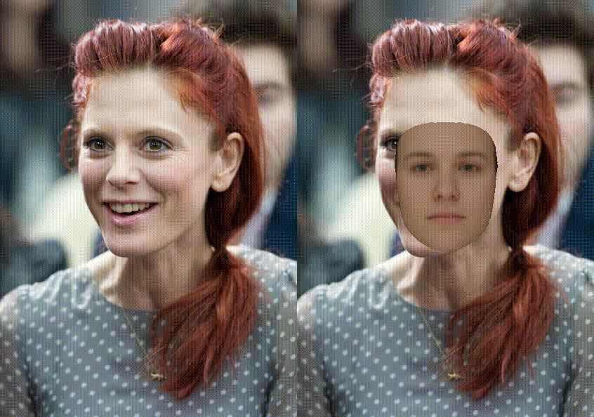
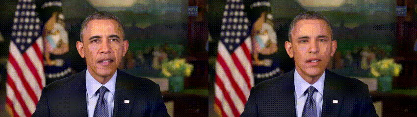

# 3DMM model fitting using Pytorch

This is a fitting framework implemented in Pytorch for reconstructing the face in an image or a video using a 3DMM model. 

The framework only uses Pytorch modules and a differentiable renderer from pytorch3d. The whole module is differentiable and can be integrated into other systems for the gradient propagation. 

## Updates
- :star2: Refactored the code to make future extension easier (other 3DMM models will be supported). The hyper-parameters are also re-organized.
- :star2: Added support for monocular video reconstruction. 
- :star2: Added support for multi-gpu when processing long videos.

<p align="center">
  
</p>

<p align="center">
  
</p>

## Installation
### Requirements
- [pytorch3d](https://github.com/facebookresearch/pytorch3d) It might require a specific version of Pytorch to make pytorch3d run succussfully on gpus, please follow the official instructions.
- Please refer to "requirements.txt" for other dependences.
- [Basel Face Model 2009 (BFM09)](https://faces.dmi.unibas.ch/bfm/index.php?nav=1-2&id=downloads)
- [Expression Basis](https://github.com/Juyong/3DFace) extra expression basis.

## How to use
### Installation
1. Clone the repo:
```
git clone https://github.com/ascust/3DMM-Fitting-Pytorch
cd 3DMM-Fitting-Pytorch
```

2. Download the Basel Face Model and put "01_MorphableModel.mat" and put it into "BFM".

3. Download the Expression Basis. Go to the [repo](https://github.com/Juyong/3DFace), download the "CoarseData" and put "Exp_Pca.bin" into "BFM".

4. Convert the BFM parameters by:
```
python convert_bfm09_data.py
```

### Single Image Reconstruction
```
python fit_single_img.py --img_path data/000002.jpg --res_folder results 
```
The results are stored in "results" folder.


### Monocular Video Reconstruction
To fit a video, simply run:
```
python fit_video.py --v_path data/sample_video.mp4 --res_folder results 
```
The script will extract frames, detact features and fit all frames. 

Fitting a video is a bit different from fitting an image, because frames are not isolated. In this implementation, we first estimate shape and texture of the target face using some of the frames (indicated by --nframes_shape). Then we estimate the other coefficients (expression, rotatation etc.) for each frame and keep the shape and texture coefficients fixed. 

For the first frame, we use much more iterations to get a good starting point. For remaining frames, each is initialized from the previous estimation.Pose regulerizers are also imposed to increase temporal consistency. 

Please check the reconstructed video in the result folder.

### Multi-gpu and -process support

It could take quite a while to process a long video, so multi-gpu and multi-process are also supported to accelerate fitting. To use this feature, simply run:
```
python fit_video.py --v_path data/sample_video.mp4 --res_folder results --ngpus 4 --nworkers 4
```
Here we use 4 gpus and 4 workers. We can also use more workers to assign each gpu with multiple workers. The video will be evenly split and each clip will be fit respectively. 

### Hyperparameters
There are bunch of parameters that might require further tuning. 
The iteration numbers for non-rigid fitting "--first_nrf_iters" and "--rest_nrf_iters" affect the fitting speed a lot since we have to render the 3d mesh in each iteration. Try to change it to find a trade-off between speed and accuracy.
If the result is not good, try to play with the parameters.

## Acknowledgement
The code is partially borrowed from [Deep3DFaceReconstrution](https://github.com/microsoft/Deep3DFaceReconstruction), which is a Tensorflow-based deep reconstruction method using CNNs. Please note that our framework does not require any pretrained deep models. We estimate the parameters directly using the landmarks and photometric loss as the supervision.
